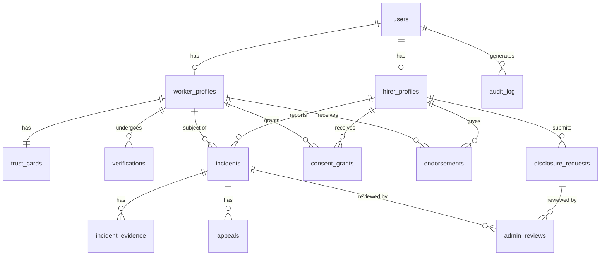

# Data Model Design

## 1. Entity-Relationship Diagram



## 2. Table Definitions

### 2.1 users

Core authentication table managed by Supabase Auth (extended with custom fields).

| Column          | Type          | Constraints                | Description                              |
|-----------------|---------------|----------------------------|------------------------------------------|
| id              | uuid          | PK, default gen_random_uuid() | Primary identifier                    |
| phone           | text          | UNIQUE, NOT NULL           | E.164 format, encrypted at field level   |
| phone_hash      | text          | UNIQUE, NOT NULL, INDEX    | SHA-256 hash for lookups without decryption |
| user_type       | enum          | NOT NULL                   | 'worker', 'hirer', 'admin'              |
| preferred_lang  | text          | DEFAULT 'hi'               | ISO 639-1 language code                  |
| status          | enum          | DEFAULT 'active'           | 'active', 'suspended', 'banned', 'deleted' |
| created_at      | timestamptz   | DEFAULT now()              |                                          |
| updated_at      | timestamptz   | DEFAULT now()              |                                          |
| last_login_at   | timestamptz   |                            |                                          |
| deleted_at      | timestamptz   |                            | Soft delete for retention compliance     |

**RLS Policy Intent:**
- Users can read and update their own row.
- Admins can read all rows, update status.
- No user can read another user's phone (only phone_hash for lookups).

**Indexes:**
- `idx_users_phone_hash` on `phone_hash` (unique).
- `idx_users_user_type` on `user_type`.
- `idx_users_status` on `status`.

---

### 2.2 worker_profiles

Extended profile data for workers. All PII fields are encrypted at the application layer before storage.

| Column              | Type          | Constraints                | Description                              |
|---------------------|---------------|----------------------------|------------------------------------------|
| id                  | uuid          | PK, default gen_random_uuid() |                                       |
| user_id             | uuid          | FK -> users.id, UNIQUE     |                                          |
| full_name           | text          | NOT NULL                   | Encrypted                                |
| full_name_search    | text          |                            | Encrypted partial for search (first 3 chars hashed) |
| display_name        | text          |                            | Worker-chosen display name (not encrypted) |
| photo_url           | text          |                            | Supabase Storage path                    |
| date_of_birth       | text          |                            | Encrypted, stored as text post-encryption |
| gender              | enum          |                            | 'male', 'female', 'other', 'prefer_not_to_say' |
| address_encrypted   | text          |                            | Full address, encrypted                  |
| city                | text          |                            | Plaintext for geographic filtering       |
| state               | text          |                            | Plaintext for geographic filtering       |
| pincode             | text          |                            | Plaintext for geographic filtering       |
| work_categories     | text[]        |                            | e.g., ['domestic_worker', 'cook', 'driver'] |
| aadhaar_last_four   | text          |                            | Last 4 digits only, for display          |
| aadhaar_encrypted   | text          |                            | Full Aadhaar number, field-level encrypted |
| platform_join_date  | date          | DEFAULT current_date       |                                          |
| is_profile_public   | boolean       | DEFAULT false              | Whether trust card is publicly visible   |
| created_at          | timestamptz   | DEFAULT now()              |                                          |
| updated_at          | timestamptz   | DEFAULT now()              |                                          |

**RLS Policy Intent:**
- Workers can read and update their own profile.
- Hirers can read only `display_name`, `photo_url`, `city`, `work_categories`, `platform_join_date` -- and only when a valid consent grant exists or profile is public.
- Admins can read all fields.
- No direct access to encrypted fields without application-layer decryption.

**Indexes:**
- `idx_worker_profiles_user_id` on `user_id` (unique).
- `idx_worker_profiles_city` on `city`.
- `idx_worker_profiles_work_categories` on `work_categories` (GIN index).

---

### 2.3 hirer_profiles

| Column              | Type          | Constraints                | Description                              |
|---------------------|---------------|----------------------------|------------------------------------------|
| id                  | uuid          | PK, default gen_random_uuid() |                                       |
| user_id             | uuid          | FK -> users.id, UNIQUE     |                                          |
| full_name           | text          | NOT NULL                   | Encrypted                                |
| display_name        | text          |                            |                                          |
| photo_url           | text          |                            |                                          |
| address_encrypted   | text          |                            | Encrypted                                |
| city                | text          |                            |                                          |
| state               | text          |                            |                                          |
| pincode             | text          |                            |                                          |
| hirer_type          | enum          | DEFAULT 'individual'       | 'individual', 'community_admin', 'community_member' |
| community_id        | uuid          | FK -> communities.id       | NULL for individual hirers               |
| verified            | boolean       | DEFAULT false              |                                          |
| created_at          | timestamptz   | DEFAULT now()              |                                          |
| updated_at          | timestamptz   | DEFAULT now()              |                                          |

**RLS Policy Intent:**
- Hirers can read and update their own profile.
- Workers can see `display_name` and `city` of hirers who have interacted with them.
- Admins can read all fields.

**Indexes:**
- `idx_hirer_profiles_user_id` on `user_id` (unique).
- `idx_hirer_profiles_community_id` on `community_id`.

---

### 2.4 trust_cards

Computed view of a worker's trust signals. This is a materialized snapshot, recomputed on relevant events.

| Column                  | Type          | Constraints                | Description                              |
|-------------------------|---------------|----------------------------|------------------------------------------|
| id                      | uuid          | PK, default gen_random_uuid() |                                       |
| worker_id               | uuid          | FK -> worker_profiles.id, UNIQUE |                                    |
| verification_tier       | enum          | DEFAULT 'unverified'       | 'unverified', 'basic_verified', 'enhanced_verified' |
| identity_verified       | boolean       | DEFAULT false              |                                          |
| background_check_status | enum          | DEFAULT 'not_started'      | 'not_started', 'pending', 'clear', 'flagged' |
| tenure_months           | integer       | DEFAULT 0                  | Months since platform join               |
| endorsement_count       | integer       | DEFAULT 0                  |                                          |
| total_incidents         | integer       | DEFAULT 0                  | Substantiated incidents only             |
| open_incidents          | integer       | DEFAULT 0                  |                                          |
| highest_severity        | enum          |                            | 'none', 'low', 'medium', 'high', 'critical' |
| incident_flag           | boolean       | DEFAULT false              | True if any substantiated incident exists |
| last_computed_at        | timestamptz   | DEFAULT now()              |                                          |
| computation_version     | integer       | DEFAULT 1                  | Schema version for trust computation     |
| created_at              | timestamptz   | DEFAULT now()              |                                          |
| updated_at              | timestamptz   | DEFAULT now()              |                                          |

**RLS Policy Intent:**
- Workers can read their own trust card.
- Hirers can read trust cards only when: (a) worker profile is public, or (b) a valid consent grant exists, or (c) a valid share token is presented.
- Admins can read and trigger recomputation of any trust card.
- Nobody can directly write to this table except the `compute-trust-card` Edge Function via `service_role`.

**Indexes:**
- `idx_trust_cards_worker_id` on `worker_id` (unique).
- `idx_trust_cards_verification_tier` on `verification_tier`.

---

### 2.5 verifications

Records of identity and background verification attempts and results.

| Column              | Type          | Constraints                | Description                              |
|---------------------|---------------|----------------------------|------------------------------------------|
| id                  | uuid          | PK, default gen_random_uuid() |                                       |
| worker_id           | uuid          | FK -> worker_profiles.id   |                                          |
| verification_type   | enum          | NOT NULL                   | 'aadhaar_ekyc', 'police_clearance', 'address_proof', 'reference_check' |
| status              | enum          | DEFAULT 'pending'          | 'pending', 'verified', 'failed', 'expired' |
| provider            | text          |                            | External verification provider name      |
| provider_ref        | text          |                            | External reference ID, encrypted         |
| result_data         | jsonb         |                            | Encrypted verification result payload    |
| verified_at         | timestamptz   |                            |                                          |
| expires_at          | timestamptz   |                            | Some verifications expire (e.g., police clearance) |
| created_at          | timestamptz   | DEFAULT now()              |                                          |

**RLS Policy Intent:**
- Workers can read their own verification records (status only, not raw result_data).
- Admins can read all fields.
- No hirer access -- verification status is surfaced only through the trust card.

**Indexes:**
- `idx_verifications_worker_id` on `worker_id`.
- `idx_verifications_type_status` on `(verification_type, status)`.

---

### 2.6 incidents

| Column              | Type          | Constraints                | Description                              |
|---------------------|---------------|----------------------------|------------------------------------------|
| id                  | uuid          | PK, default gen_random_uuid() |                                       |
| reported_by         | uuid          | FK -> hirer_profiles.id    |                                          |
| worker_id           | uuid          | FK -> worker_profiles.id   |                                          |
| incident_type       | enum          | NOT NULL                   | 'theft', 'misconduct', 'property_damage', 'harassment', 'safety_concern', 'other' |
| severity            | enum          | NOT NULL                   | 'low', 'medium', 'high', 'critical'     |
| description         | text          | NOT NULL                   | Encrypted                                |
| incident_date       | date          | NOT NULL                   |                                          |
| status              | enum          | DEFAULT 'pending_review'   | 'pending_review', 'under_investigation', 'substantiated', 'unsubstantiated', 'inconclusive', 'appealed', 'appeal_resolved' |
| resolution_notes    | text          |                            | Admin notes, encrypted                   |
| resolved_by         | uuid          | FK -> users.id             | Admin who resolved                       |
| resolved_at         | timestamptz   |                            |                                          |
| worker_notified_at  | timestamptz   |                            |                                          |
| appeal_deadline     | timestamptz   |                            | resolved_at + 7 days                     |
| created_at          | timestamptz   | DEFAULT now()              |                                          |
| updated_at          | timestamptz   | DEFAULT now()              |                                          |

**RLS Policy Intent:**
- Hirers can read incidents they reported (own submissions only).
- Workers can read incidents where they are the subject (limited fields: type, severity, status, resolution -- not description or evidence).
- Admins can read and update all fields.
- No cross-user access: hirer A cannot see hirer B's reports on the same worker.

**Indexes:**
- `idx_incidents_worker_id` on `worker_id`.
- `idx_incidents_reported_by` on `reported_by`.
- `idx_incidents_status` on `status`.
- `idx_incidents_status_created` on `(status, created_at)` for admin queue ordering.

---

### 2.7 incident_evidence

| Column              | Type          | Constraints                | Description                              |
|---------------------|---------------|----------------------------|------------------------------------------|
| id                  | uuid          | PK, default gen_random_uuid() |                                       |
| incident_id         | uuid          | FK -> incidents.id, NOT NULL |                                         |
| uploaded_by         | uuid          | FK -> users.id             |                                          |
| file_type           | enum          | NOT NULL                   | 'photo', 'document', 'video', 'audio'   |
| storage_path        | text          | NOT NULL                   | Supabase Storage path (encrypted bucket) |
| file_hash           | text          | NOT NULL                   | SHA-256 hash for integrity verification  |
| file_size_bytes     | integer       |                            |                                          |
| metadata            | jsonb         |                            | EXIF stripped, only relevant metadata    |
| created_at          | timestamptz   | DEFAULT now()              |                                          |

**RLS Policy Intent:**
- Only the uploader and admins can access evidence files.
- Workers who are incident subjects cannot access evidence (to prevent retaliation).
- Evidence access is logged to audit_log.

**Indexes:**
- `idx_incident_evidence_incident_id` on `incident_id`.

---

### 2.8 appeals

| Column              | Type          | Constraints                | Description                              |
|---------------------|---------------|----------------------------|------------------------------------------|
| id                  | uuid          | PK, default gen_random_uuid() |                                       |
| incident_id         | uuid          | FK -> incidents.id, NOT NULL |                                         |
| worker_id           | uuid          | FK -> worker_profiles.id   |                                          |
| appeal_text         | text          | NOT NULL                   | Encrypted                                |
| supporting_evidence | text[]        |                            | Storage paths to uploaded evidence        |
| status              | enum          | DEFAULT 'pending'          | 'pending', 'under_review', 'upheld', 'overturned', 'partially_overturned' |
| reviewer_id         | uuid          | FK -> users.id             |                                          |
| review_notes        | text          |                            | Encrypted                                |
| reviewed_at         | timestamptz   |                            |                                          |
| created_at          | timestamptz   | DEFAULT now()              |                                          |
| updated_at          | timestamptz   | DEFAULT now()              |                                          |

**RLS Policy Intent:**
- Workers can create appeals for incidents where they are the subject, and read their own appeals.
- Admins can read and update all appeals.
- Hirers cannot see appeal details.

**Indexes:**
- `idx_appeals_incident_id` on `incident_id`.
- `idx_appeals_worker_id` on `worker_id`.
- `idx_appeals_status` on `status`.

---

### 2.9 consent_grants

| Column              | Type          | Constraints                | Description                              |
|---------------------|---------------|----------------------------|------------------------------------------|
| id                  | uuid          | PK, default gen_random_uuid() |                                       |
| worker_id           | uuid          | FK -> worker_profiles.id   | The data subject                         |
| granted_to          | uuid          | FK -> hirer_profiles.id    | The data recipient                       |
| scope               | text[]        | NOT NULL                   | Fields accessible: e.g., ['trust_card', 'verification_tier', 'work_history'] |
| granted_at          | timestamptz   | DEFAULT now()              |                                          |
| expires_at          | timestamptz   | NOT NULL                   | Consent is always time-limited           |
| revoked_at          | timestamptz   |                            | NULL if still active                     |
| revocation_reason   | text          |                            |                                          |
| share_token         | text          | UNIQUE                     | Opaque token for URL-based sharing       |
| token_expires_at    | timestamptz   |                            | Token may expire before grant itself     |
| max_views           | integer       |                            | Optional view count limit                |
| view_count          | integer       | DEFAULT 0                  |                                          |
| created_at          | timestamptz   | DEFAULT now()              |                                          |

**RLS Policy Intent:**
- Workers can create, read, and revoke their own consent grants.
- Hirers can read consent grants where they are the `granted_to` party.
- System checks consent_grants on every data access to enforce scope.
- Admins can read all grants for audit purposes.

**Indexes:**
- `idx_consent_grants_worker_id` on `worker_id`.
- `idx_consent_grants_granted_to` on `granted_to`.
- `idx_consent_grants_share_token` on `share_token` (unique).
- `idx_consent_grants_active` on `(worker_id, granted_to)` WHERE `revoked_at IS NULL AND expires_at > now()`.

---

### 2.10 endorsements

| Column              | Type          | Constraints                | Description                              |
|---------------------|---------------|----------------------------|------------------------------------------|
| id                  | uuid          | PK, default gen_random_uuid() |                                       |
| worker_id           | uuid          | FK -> worker_profiles.id   |                                          |
| endorsed_by         | uuid          | FK -> hirer_profiles.id    |                                          |
| endorsement_text    | text          |                            | Optional free-text, moderated            |
| work_category       | text          |                            | Which role was endorsed                  |
| relationship_months | integer       |                            | How long the hirer employed the worker   |
| is_active           | boolean       | DEFAULT true               | Can be deactivated by admin moderation   |
| created_at          | timestamptz   | DEFAULT now()              |                                          |

**RLS Policy Intent:**
- Workers can read endorsements about themselves.
- Hirers can create endorsements and read their own submissions.
- Endorsement count (not text) is visible on trust card per consent rules.
- Admins can moderate (deactivate) endorsements.

**Indexes:**
- `idx_endorsements_worker_id` on `worker_id`.
- `idx_endorsements_endorsed_by` on `endorsed_by`.

---

### 2.11 audit_log

Append-only log of all data access and mutations. Critical for compliance with DPDP Act 2023.

| Column              | Type          | Constraints                | Description                              |
|---------------------|---------------|----------------------------|------------------------------------------|
| id                  | uuid          | PK, default gen_random_uuid() |                                       |
| actor_id            | uuid          | FK -> users.id             | Who performed the action                 |
| actor_type          | enum          | NOT NULL                   | 'worker', 'hirer', 'admin', 'system'    |
| action              | text          | NOT NULL                   | e.g., 'trust_card.view', 'incident.create', 'pii.decrypt' |
| resource_type       | text          | NOT NULL                   | e.g., 'trust_card', 'worker_profile', 'incident' |
| resource_id         | uuid          |                            | ID of the accessed resource              |
| details             | jsonb         |                            | Additional context (fields accessed, consent_grant_id used) |
| ip_address          | inet          |                            |                                          |
| user_agent          | text          |                            |                                          |
| created_at          | timestamptz   | DEFAULT now()              |                                          |

**RLS Policy Intent:**
- Append-only: no updates or deletes permitted, not even by admins.
- Admins can read all logs.
- Workers can read logs where they are the `resource_id` subject (to see who accessed their data).
- Hirers cannot read audit logs.
- Insert-only policy for application via `service_role`.

**Indexes:**
- `idx_audit_log_actor_id` on `actor_id`.
- `idx_audit_log_resource` on `(resource_type, resource_id)`.
- `idx_audit_log_created_at` on `created_at` (for time-range queries).
- Table partitioned by month on `created_at`.

---

### 2.12 disclosure_requests

Handles lawful disclosure requests from law enforcement or courts.

| Column              | Type          | Constraints                | Description                              |
|---------------------|---------------|----------------------------|------------------------------------------|
| id                  | uuid          | PK, default gen_random_uuid() |                                       |
| requested_by        | uuid          | FK -> users.id             | May be an admin acting on behalf of authority |
| worker_id           | uuid          | FK -> worker_profiles.id   | Subject of the request                   |
| authority_name      | text          | NOT NULL                   | e.g., 'Mumbai Police', 'District Court Bangalore' |
| authority_type      | enum          | NOT NULL                   | 'police', 'court', 'regulatory_body'    |
| legal_reference     | text          | NOT NULL                   | Case number, FIR number, court order reference |
| legal_basis         | text          | NOT NULL                   | Specific legal provision (e.g., 'CrPC Section 91') |
| scope_requested     | text[]        | NOT NULL                   | Fields requested                         |
| scope_approved      | text[]        |                            | Fields actually disclosed                |
| supporting_document | text          |                            | Storage path to court order / FIR copy   |
| status              | enum          | DEFAULT 'pending'          | 'pending', 'approved', 'partially_approved', 'rejected', 'escalated' |
| reviewed_by         | uuid          | FK -> users.id             | Compliance officer                       |
| review_notes        | text          |                            | Encrypted                                |
| worker_notified     | boolean       | DEFAULT false              |                                          |
| worker_notified_at  | timestamptz   |                            |                                          |
| disclosed_at        | timestamptz   |                            |                                          |
| created_at          | timestamptz   | DEFAULT now()              |                                          |
| updated_at          | timestamptz   | DEFAULT now()              |                                          |

**RLS Policy Intent:**
- Only compliance officers and super admins can read and update disclosure requests.
- Workers are notified post-disclosure (unless court order prohibits notification).
- All access logged to audit_log.

**Indexes:**
- `idx_disclosure_requests_worker_id` on `worker_id`.
- `idx_disclosure_requests_status` on `status`.

---

### 2.13 admin_reviews

| Column              | Type          | Constraints                | Description                              |
|---------------------|---------------|----------------------------|------------------------------------------|
| id                  | uuid          | PK, default gen_random_uuid() |                                       |
| reviewer_id         | uuid          | FK -> users.id, NOT NULL   |                                          |
| review_type         | enum          | NOT NULL                   | 'incident', 'appeal', 'disclosure', 'moderation' |
| target_id           | uuid          | NOT NULL                   | ID of the incident, appeal, or disclosure request |
| action_taken        | text          | NOT NULL                   | e.g., 'substantiated', 'overturned', 'approved' |
| notes               | text          |                            | Encrypted                                |
| time_spent_minutes  | integer       |                            | For SLA tracking                         |
| created_at          | timestamptz   | DEFAULT now()              |                                          |

**RLS Policy Intent:**
- Admins can read and create reviews.
- No worker or hirer access.

**Indexes:**
- `idx_admin_reviews_target` on `(review_type, target_id)`.
- `idx_admin_reviews_reviewer` on `reviewer_id`.

## 3. Encryption Strategy

### 3.1 Field-Level Encryption

The following fields use application-layer AES-256-GCM encryption before storage:

| Table             | Encrypted Fields                                      |
|-------------------|-------------------------------------------------------|
| users             | phone                                                 |
| worker_profiles   | full_name, date_of_birth, address_encrypted, aadhaar_encrypted |
| hirer_profiles    | full_name, address_encrypted                          |
| incidents         | description, resolution_notes                         |
| appeals           | appeal_text, review_notes                             |
| disclosure_requests | review_notes                                        |
| admin_reviews     | notes                                                 |

### 3.2 Key Management

- Encryption keys stored in Supabase Vault (not in application code or environment variables).
- Key hierarchy: Master Key -> Table-level Data Encryption Keys (DEKs).
- DEK rotation every 90 days. Old DEKs retained for decryption of historical data.
- Re-encryption batch job runs after key rotation.

## 4. Data Integrity Constraints

### 4.1 Database-Level Constraints

```sql
-- A user can be either a worker or a hirer, not both
-- Enforced by user_type enum and separate profile tables

-- Consent grants must expire in the future
ALTER TABLE consent_grants ADD CONSTRAINT chk_consent_expiry
  CHECK (expires_at > granted_at);

-- Appeals can only be created within the appeal window
-- Enforced at application layer (tRPC middleware)

-- Audit log is append-only
REVOKE UPDATE, DELETE ON audit_log FROM PUBLIC;
REVOKE UPDATE, DELETE ON audit_log FROM authenticated;

-- Incidents must reference valid worker and hirer
ALTER TABLE incidents ADD CONSTRAINT fk_incidents_worker
  FOREIGN KEY (worker_id) REFERENCES worker_profiles(id);
ALTER TABLE incidents ADD CONSTRAINT fk_incidents_reporter
  FOREIGN KEY (reported_by) REFERENCES hirer_profiles(id);
```

### 4.2 Application-Level Invariants

- A worker cannot endorse themselves.
- A hirer cannot report an incident against a worker they have no employment relationship with (soft check, not hard constraint).
- Consent scope values must be from a predefined allowlist.
- Evidence files must pass virus scanning before storage.
- Trust card computation is idempotent -- running it twice produces the same result.

## 5. Migration Strategy

### 5.1 Migration Naming

```
YYYYMMDDHHMMSS_description.sql
```

Example: `20260321120000_create_users_table.sql`

### 5.2 Migration Order

1. `create_enums` -- All custom enum types.
2. `create_users` -- Users table with Supabase Auth integration.
3. `create_worker_profiles` -- Worker profile extension.
4. `create_hirer_profiles` -- Hirer profile extension.
5. `create_trust_cards` -- Trust card materialized view.
6. `create_verifications` -- Verification records.
7. `create_incidents` -- Incident reporting.
8. `create_incident_evidence` -- Evidence attachments.
9. `create_appeals` -- Appeal records.
10. `create_consent_grants` -- Consent management.
11. `create_endorsements` -- Endorsement records.
12. `create_audit_log` -- Audit trail (partitioned).
13. `create_disclosure_requests` -- Lawful disclosure.
14. `create_admin_reviews` -- Admin review records.
15. `create_rls_policies` -- All RLS policies.
16. `create_indexes` -- All custom indexes.
17. `create_functions` -- Database functions and triggers.

### 5.3 Trigger Functions

```sql
-- Auto-update updated_at on row modification
CREATE OR REPLACE FUNCTION update_updated_at()
RETURNS TRIGGER AS $$
BEGIN
  NEW.updated_at = now();
  RETURN NEW;
END;
$$ LANGUAGE plpgsql;

-- Auto-log to audit_log on sensitive table access
-- (Implemented as Supabase Edge Function middleware, not DB trigger,
--  to capture application context like IP and user agent.)
```
